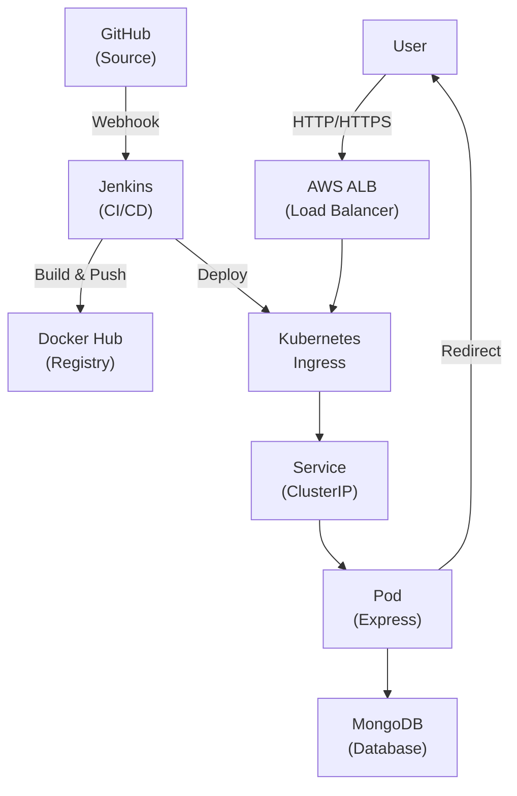

# URL Shortener Platform

A production-ready URL shortening service with distributed deployment on AWS EKS, featuring a complete CI/CD pipeline, infrastructure-as-code, and zero-downtime rolling updates.

## Table of Contents

1. [Overview](#overview)
2. [System Architecture](#system-architecture)
3. [Repository Structure](#repository-structure)
4. [Tech Stack](#tech-stack)
5. [Local Setup](#local-setup)
6. [Terraform Deployment](#terraform-deployment)
7. [Kubernetes Deployment](#kubernetes-deployment)
8. [Jenkins CI/CD Pipeline](#jenkins-cicd-pipeline)
9. [API Documentation](#api-documentation)
10. [Production Deployment Flow](#production-deployment-flow)
11. [Troubleshooting](#troubleshooting)
12. [Future Enhancements](#future-enhancements)
13. [License](#license)

---

## 1. Overview

The URL Shortener Platform converts long URLs into short, shareable links with automatic redirect counting. It's designed as a cloud-native, scalable microservice deployable on Kubernetes with automated CI/CD pipelines and infrastructure provisioning.

**Key Features:**
- Create shortened URLs with collision-resistant encoding
- Redirect with automatic visit tracking
- RESTful API with JSON responses
- Docker containerization with multi-stage builds
- Kubernetes deployment with auto-scaling
- Infrastructure-as-code with Terraform
- Automated testing and deployment via Jenkins
- Zero-downtime rolling updates
- Bootstrap-based web frontend

---

## 2. System Architecture



---

## 3. Repository Structure

```
.
├── src/
│   ├── index.js                 # Express server entry
│   ├── routes/urls.js           # API endpoints
│   ├── db/
│   │   ├── database.js          # MongoDB connection
│   │   └── schema.sql           # Database schema
│   └── helpers/
│       ├── shortener.js         # URL encoding logic
│       └── validator.js         # Input validation
├── public/
│   ├── index.html               # Web frontend
│   └── app.js                   # Frontend logic
├── k8s/
│   ├── deployment.yaml          # Pod specifications
│   ├── service.yaml             # Kubernetes Service
│   ├── ingress.yaml             # External routing
│   ├── configmap.yaml           # Config variables
│   └── secrets.yaml             # Sensitive data
├── infra/terraform/
│   ├── main.tf                  # VPC & networking
│   ├── eks.tf                   # EKS cluster config
│   ├── iam.tf                   # IAM roles & policies
│   └── variables.tf             # Terraform variables
├── docker-compose.yml           # Local development
├── Dockerfile                   # Multi-stage build
├── Jenkinsfile                  # CI/CD pipeline definition
├── package.json                 # Node.js dependencies
└── README.md                    # This file
```

---

## 4. Tech Stack

| Component | Technology |
|-----------|-----------|
| **Backend** | Node.js 18+, Express.js |
| **Database** | MongoDB |
| **Containerization** | Docker, Docker Compose |
| **Orchestration** | Kubernetes (EKS) |
| **Infrastructure** | Terraform, AWS |
| **CI/CD** | Jenkins, GitHub Webhooks |
| **Load Balancing** | AWS ALB, Kubernetes Ingress |
| **Frontend** | Bootstrap, Vanilla JavaScript |

---

## 5. Local Setup

### Prerequisites
- Node.js 18+
- Docker & Docker Compose (or Docker Desktop)
- MongoDB (local or Docker)
- npm

### Clone & Setup

```bash
# 1. Clone repository
git clone https://github.com/r-khaled/YRL-shortener-Project.git
cd YRL-shortener-Project

# 2. Copy environment variables
cp .env.example .env
# Edit .env: Set DATABASE_URL, PORT, BASE_URL

# 3. Option A: Run with Docker Compose (Recommended)
docker-compose up --build
# App available at http://localhost:3000

# 3. Option B: Run manually
npm install
npm run dev              # Development with auto-reload
npm start               # Production mode
# App available at http://localhost:3000
```

---

## 6. Terraform Deployment

### Prerequisites
- AWS account with access keys
- Terraform 1.3+
- AWS CLI configured (`aws configure`)

### Deploy Infrastructure

```bash
cd infra/terraform

# 1. Initialize Terraform
terraform init

# 2. Validate configuration
terraform validate

# 3. Plan deployment (review changes)
terraform plan -out=tfplan

# 4. Apply deployment
terraform apply tfplan

# 5. Configure kubectl
aws eks update-kubeconfig --region us-east-1 --name my-eks-cluster
kubectl cluster-info
```

**Resources Provisioned:**
- VPC with public & private subnets
- Internet Gateway & NAT Gateway
- Security groups with appropriate rules
- EKS cluster with managed node group (t3.medium, 2-10 nodes)
- IAM roles for cluster & nodes
- VPC endpoints for AWS services

**Cleanup:** `terraform destroy`

---

## 7. Kubernetes Deployment

### Prerequisites
- EKS cluster running (from Terraform)
- kubectl configured
- Docker image pushed to registry

### Deploy Application

```bash
# 1. Apply all manifests
kubectl apply -f k8s/

# 2. Verify deployment
kubectl get pods -n app
kubectl get svc -n app
kubectl get ingress -n app

# 3. View application logs
kubectl logs -f deployment/url-shortener -n app

# 4. Port-forward for local testing (optional)
kubectl port-forward svc/url-shortener 3000:80 -n app
```

**Useful Commands:**
```bash
kubectl describe pod <pod-name> -n app          # Inspect pod details
kubectl exec -it <pod-name> -n app -- /bin/sh  # Shell into pod
kubectl rollout restart deployment/url-shortener -n app  # Restart pods
kubectl scale deployment url-shortener --replicas=3 -n app  # Scale replicas
```

---

## 8. Jenkins CI/CD Pipeline

### Pipeline Stages
1. **Checkout** — Clone code from GitHub
2. **Install & Test** — Run npm tests
3. **Build Docker** — Create container image
4. **Push Registry** — Push to Docker Hub
5. **Deploy** — Update Kubernetes deployment
6. **Verify** — Health checks

### Setup (5 Steps)

**1. Install Jenkins Plugins**
- GitHub Integration
- Docker Pipeline
- Kubernetes

**2. Add Credentials** (Jenkins UI → Manage Credentials)
```
dockerhub-credentials: Username & Password for Docker Hub
aws-credentials: AWS Access Key ID & Secret Key
```

**3. Create Pipeline Job**
- New Pipeline job
- Point SCM to this repository
- Configure to use Jenkinsfile

**4. Configure GitHub Webhook**
GitHub Repo → Settings → Webhooks → Add
```
Payload URL: https://your-jenkins-url/github-webhook/
Events: Push events
```

**5. Local Testing with ngrok** (for webhook testing without public Jenkins)
```bash
ngrok http 8080
# Update GitHub webhook URL to: https://xxxxx.ngrok.io/github-webhook/
```

### Trigger Pipeline
```bash
# Automatic: Push to main branch
git push origin main

# Manual: Jenkins UI → Build Now
```

---

## 9. API Documentation

**Base URL:** `http://localhost:3000` (local) | `https://shortener.example.com` (production)

### Shorten URL
```http
POST /api/urls
Content-Type: application/json

{
  "longUrl": "https://www.github.com/r-khaled/very-long-repository-name"
}
```

**Response (201 Created):**
```json
{
  "id": 1,
  "shortCode": "abc123X",
  "shortUrl": "http://localhost:3000/abc123X",
  "longUrl": "https://www.github.com/r-khaled/very-long-repository-name",
  "visits": 0,
  "createdAt": "2025-11-30T15:00:00Z"
}
```

### Redirect & Count
```http
GET /abc123X
```
Responds with **302 redirect** to original URL, increments visit count.

### List All URLs
```http
GET /api/urls
```

**Response (200 OK):**
```json
[
  {
    "id": 1,
    "shortCode": "abc123X",
    "shortUrl": "http://localhost:3000/abc123X",
    "longUrl": "https://example.com",
    "visits": 42,
    "createdAt": "2025-11-30T15:00:00Z"
  }
]
```

---

## 10. Production Deployment Flow

```
Code Commit
    ↓
GitHub Webhook
    ↓
Jenkins Triggered
    ↓
Build & Test (npm test)
    ↓
Build Docker Image
    ↓
Push to Docker Hub
    ↓
Update K8s Deployment
    ↓
Rolling Update (zero downtime)
    ↓
Health Checks (readiness, liveness)
    ↓
Production Live
```

---

## 11. Troubleshooting

| Issue | Solution |
|-------|----------|
| **Terraform apply fails** | Run `terraform validate` and check AWS credentials via `aws sts get-caller-identity` |
| **ImagePullBackOff in K8s** | Verify image exists: `docker pull your-repo/url-shortener:latest` |
| **Pod CrashLoopBackOff** | Check logs: `kubectl logs <pod-name> -n app` and verify ConfigMap values |
| **Webhook not triggering** | Verify GitHub webhook URL is correct and Jenkins is accessible |
| **Jenkins Docker not found** | Ensure Docker is installed on Jenkins agent and Jenkins user has docker group permissions |
| **Service not accessible** | Check endpoints: `kubectl get endpoints url-shortener -n app` |
| **Database connection error** | Verify MongoDB URI in ConfigMap/Secrets and network connectivity |
| **Ingress returns 502** | Ensure service is running: `kubectl get svc -n app` |

---

## 12. Future Enhancements

- Custom domain support for shortened URLs
- Advanced analytics dashboard (geography, device, referrer)
- User authentication & API keys
- Rate limiting & DDoS protection
- Redis caching layer
- Prometheus & Grafana monitoring
- Auto-scaling based on traffic metrics
- URL expiration policies
- Shortened link previews
- Batch URL shortening API

---

## 13. License & Author

**License:** MIT

**Author:** Khaled  
**GitHub:** [@r-khaled](https://github.com/r-khaled)

See [LICENSE](./LICENSE) file for full details.

---

<div align="center">
  
**If you found this project helpful, please star the repository!**

Made with care for production-ready URL shortening.

</div>
